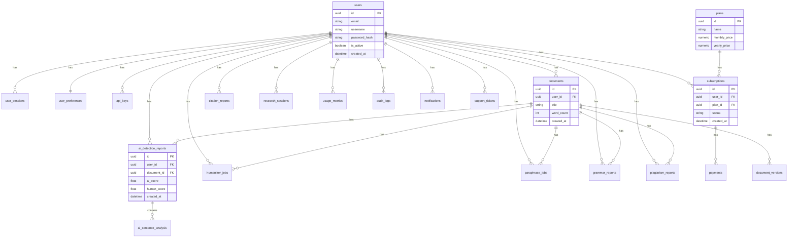

# Database Architecture

This document describes the PostgreSQL database architecture for Schoolarshild.

## Entity Relationship Diagram

## Schema Details

- **Users**: Central entity with authentication details. Uses Soft Delete.
- **Subscriptions**: Links Users to Plans. Stores Stripe/Provider details. Uses Soft Delete.
- **Documents**: Represents text files uploaded or edited by users. Has a one-to-many relationship with `document_versions` to track changes over time. Uses Soft Delete.
- **AI Modules**: Separate tables for each AI feature (Detection, Humanizer, Paraphrase, Grammar, Citations). They link back to the user and the document (if applicable).
- **System**: Tracks metrics, audit logs, and notifications. Audit logs store JSON metadata.
